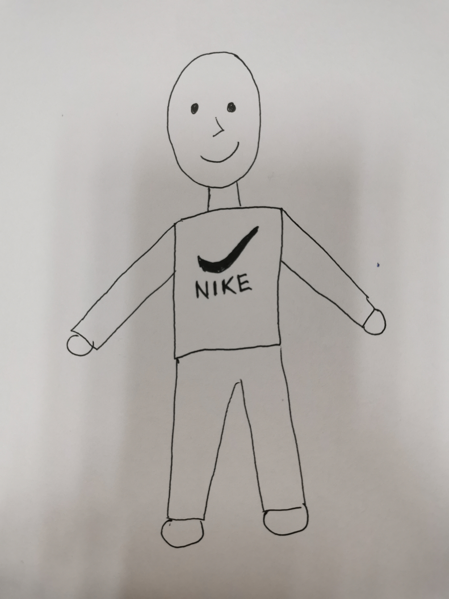

# NTU Computer Graphic 2023 Final Project

## Description
We re-implemented and modified the paper "A Method for Animating Children's Drawings of the Human Figure" (SIGGRAPH 2023) as our final project.
This project is written in python, feel free to fork and play with yourself!

## Member
we are from NTU GICE DISP Lab (台大電信所R11)
- 顏子鈞
- 許宸睿
- 李振勳 

## Dependencies
please install them using ```pip install -r requirements.txt```.

## Execution
To obtain the motion-retargetted video of a selected drawing figure:
```
$ python main.py --drawing <figure_name> --motion <motion_num> --strip <strip_num> --sk_pts <sk_pts>
``` 
where:
- ```<figure_name>``` can be anyone of figures located in ```config.py```. Default = ```stickman1```. You can choose ```15```/```17```/```19```.
- ```<motion_num>``` is the name of target motion video located in ```target_motion_data/```. For example, inputting ```<motion_num>``` as ```14``` will choose the video ```14.mp4```
- ```<strip>``` is the triangle mesh resolution, you can choose ```2``` or ```4```. (Note: smaller value requires larger computation)
- ```<sk_pts>``` is the total skeleton point used in motion retargetting. Default = ```19```. You can choose ```15```/```17```/```19```.
> For more detail of args, please see ```main.py```.
  
To stitch the motion-retargetted video and background video together:
```
$ python modify_video_background.py --pos <leftOrRight> --vid2 <background_video_path> --output <output_path>
```
where:
- ```<pos>``` is ```left``` or ```right```. This is where you stitch your video.
- ```<vid2>``` is the path to background video.
- ```<output_path>``` is the path of output video. Default = ```output/test_background_output.mp4```
> For more detail of args, please see ```main.py```.

## Example Result
1. (drawing) stickman1 + (motion)   



## References
This implementation is based on:
- "A Method for Animating Children's Drawings of the Human Figure" (SIGGRAPH 2023)
- "Implementing As-Rigid-As-Possible Shape Manipulation and Surface Flattening" (Journal of Graphics Gpu & Game Tools, 2009)
- [facebookresearch/AnimatedDrawings](https://github.com/facebookresearch/AnimatedDrawings)
    - we only use code in ```animated_drawings/model/arap.py```: see here [link](https://github.com/facebookresearch/AnimatedDrawings/blob/main/animated_drawings/model/arap.py)